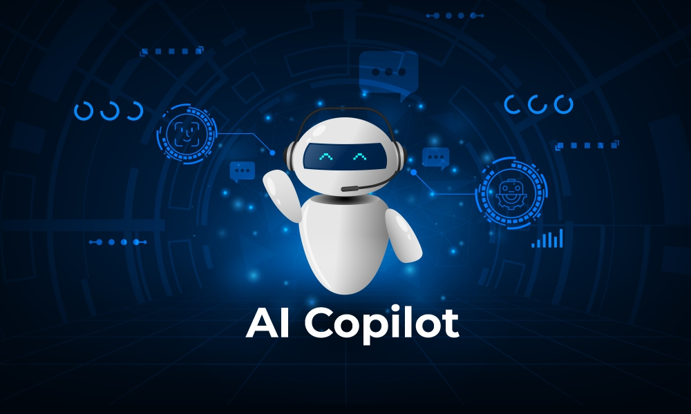

## I. Introduction

Artificial Intelligence, commonly known as AI, has revolutionized the academic scene—providing in-depth lecture explanations to brainstorming ideas for papers. AI technology has grown tremendously over the past few years, and many educational institutions are now implementing AI to enhance learning and systems. It is especially integrated in my software engineering class, ICS 314. We were encouraged to use AI as a means of assisting us with our learning and productivity, not to take away our ability to think and solve problems.

In ICS 314, AI was very useful in prompt engineering, workflow optimization, and integrated testing. These were concepts that I had difficulty with in the beginning, but as I utilized AI to tackle these tasks, I became more acquainted with them. Some tools that I found useful in this journey were ChatGPT, Claude, and Co-Pilot, and each had their strengths and weaknesses, which I will explain later. In short, AI has become an integral part of the software engineering scene, and it will keep evolving and perfecting its abilities as the future grows nearer.

## II. Personal Experience with AI

Throughout ICS 314, I’ve had many experiences with AI in my WODs, assignments, and other projects. In all of these cases, I used AI as a medium to enhance and propel my knowledge and learning to new heights. I also challenged myself to use AI beyond the basic “Can you look this up for me?” type of prompt and instead approach it from a software engineer perspective.

### Experience WODs

For the Experience WODs, I used ChatGPT to help me generate methods. For example, in the E19 WOD, I used ChatGPT to help me implement a listCampuses function. I prompted something like: "Can you write a listCampuses function with these parameters <WOD-parameters>?" ChatGPT was great at producing a rough skeleton of the function, but I still needed to go in and adjust a few things, such as fixing variable names to match the assignment instructions, adjusting return types, and modifying logic to account for edge cases that were not mentioned in my prompt. This helped me understand that AI can give a strong starting point, but it still requires careful review and understanding to make the solution fully correct.

I found ChatGPT to be useful in the basic TypeScript experience WODs as I was still introducing myself to the functions of the language. However, when we started doing Experience WODs dealing with Bootstrap, React, and Next.js, I found it easier to refer to the screencasts rather than prompt an AI for assistance. In those cases, AI would sometimes lead me in the wrong direction, where I’d ask it to provide styling for a certain page and it would create a complex code block that didn’t align with my existing code or the way the course expected things to be done. Overall, I believe that ChatGPT is a good learning tool for Experience WODs, especially when starting out.

### In-class Practice WODs

For the in-class practice WODs, I found that using ChatGPT and Co-pilot helped me reach solutions more efficiently. Being under a time constraint while still learning the concepts and language was stressful, so AI made the process smoother. However, I still relied on my own knowledge alongside AI because the practice WODs were done in groups and were not graded assessments. I don’t remember the exact prompts, but the basic structure I used was: “Can you build a program based on <WOD-instructions>?” In most cases, the program generated by AI was almost complete, requiring only minor tweaks. In some instances, especially for more complex WODs involving Bootstrap and React, I had to fix almost everything because ChatGPT or Co-pilot misinterpreted my prompt. Overall, AI was a helpful guide, but I still actively engaged in problem-solving.

### In-class WODs

As for the in-class WODs, I relied on ChatGPT and Co-pilot a bit more due to the time pressure and stakes. My prompting approach was similar: “Can you build a program based on <WOD-instructions>?” Again, most of the time, the program generated by AI required only minor adjustments. However, in more complex WODs with Bootstrap or React, I often had to correct or rebuild significant portions because the AI misunderstood the prompt. Despite this, I found AI extremely useful in these high-pressure situations. It not only helped me complete tasks more efficiently but also taught me how to manage my time and stress better by showing which tasks to tackle first.

### Essays

For the essays, I did not use AI because I felt there was no need to. These essays were supposed to be authentic and reflective. In my past experiences with AI and writing, I found that AI was not as strong of a writer as it is a coder. The flow of its writing felt too mechanical for my liking, and I found it faster to draft and polish my ideas myself rather than repeatedly prompting AI. I also genuinely enjoy writing and expressing my ideas, so I didn’t see a reason to use AI for this part of the course.

### Final Project

For my final project, ChatGPT and Co-Pilot were integral tools in the development of the application. I found that Co-Pilot was much faster than ChatGPT because it had access to both the frontend and backend files. I also felt that it had better suggestions for a working application compared to ChatGPT. I had the ability to switch between different models in Co-Pilot, which is how I found that Claude was particularly strong at backend and API work. Using the ChatGPT model within Co-Pilot also felt much faster than using it in a separate browser. Since I had access to the pro plan, I would switch between Claude and ChatGPT depending on the task—Claude for backend logic and APIs, and ChatGPT for frontend components.

My prompts often followed formats like pasting the full task with context or a condensed version such as:

Please do all work for this task in a branch named issue-31.
Make sure Admin page has no hard-coded elements
Admin-only endpoints
GET /api/admin/users
GET /api/admin/flags
POST /api/admin/resolve-flag

Or:

Can you add a sidebar to the admin page.tsx with the user profile image, name, checklist of tasks with add and delete functionality, and statistics?

I learned that providing more information about my intentions and the purpose of the application helped Co-Pilot respond more accurately. However, there were cases where being too descriptive caused issues, such as when working with mockups, where it implemented fully functioning components when I only wanted placeholders. Overall, Co-Pilot was a great tool during the building and refining of my final project and helped me work more efficiently.

### Learning a Concept / Tutorial

For learning concepts or tutorials, I didn’t use AI that much because the screencasts and readings were usually sufficient. However, some screencasts were outdated, such as those that still referred to Meteor. In those cases, I turned to AI for help. For example, I prompted ChatGPT to explain UI Design Basics in terms of Next.js instead. I also used ChatGPT to explain difficult concepts like application design in Next.js and Playwright testing. If AI’s explanation wasn’t sufficient, I supplemented it with YouTube videos to solidify my understanding. Overall, ChatGPT was very useful in making new concepts feel easier and more manageable.

### Answering a Question in Class or Discord

During in-class group discussions, we often used AI to search for answers to questions. However, the answers AI provided were sometimes incomplete or even incorrect, based on the feedback from our professor. I learned that AI requires careful prompting to provide useful responses to specific questions. If you simply copy and paste a question, AI tends to pull information from various sources and give a summarized, surface-level answer. Therefore, I found that AI works best when answering questions with some context, and it’s helpful to have background knowledge, as AI can still produce vague responses.

### Asking or Answering a Smart Question

I found that asking AI a well-structured “smart question” was quicker than asking on Discord, as AI provides an instant response. However, as mentioned before, including background information with the question is important because AI otherwise tends to give surface-level answers. This approach was especially helpful during the deployment experience, where the instructions were outdated and Discord responses were often delayed. Using ChatGPT, I received a clear rundown of the steps I needed to take, but I still double-checked its suggestions while completing the deployment. In the end, I successfully deployed the project on Vercel with ChatGPT’s assistance, but it required careful attention to detail to avoid mistakes, such as installing or calling the wrong components.

### Coding Examples

For coding examples, I used ChatGPT frequently at the beginning when learning TypeScript and JavaScript. I remember prompting something like: “Can you provide coding snippets of TypeScript and JavaScript and explain the differences between them?” Although the explanation was still confusing at first, seeing side-by-side code examples helped me visually understand the differences. Therefore, I think that using AI to provide examples of code is a great way to get guidance when learning new language and other new concepts.

### Explaining Code

I relied heavily on AI, specifically Co-pilot, throughout my final project to help me understand the code. For instance, when implementing functionality on the admin pages, I frequently prompted Co-pilot to explain what each function and helper did. I also used it to interpret the code my teammates had written, which helped me understand the overall flow of the application and anticipate how my changes might affect it. Using AI to clarify the code in my final project was an essential part of my development process, enabling me to quickly grasp the fundamentals and spend more time building or refining other aspects of the program.

### Writing Code

For the in-class WODs and my final project, I used ChatGPT and Co-pilot to write most of the code. Specifically for my final project, I relied on Co-pilot to make changes and suggest code since many of the concepts and technical skills required weren’t fully covered in class. However, I still made changes manually when I caught errors myself or needed to handle CSS styling and other HTML coding, which we had learned in class. Most importantly, I carefully monitored the changes Co-pilot suggested before implementing them to ensure they aligned with the flow of the application. Overall, AI handled much of the code writing for both the WODs and my final project, but I was actively involved in reviewing and correcting errors. Additionally, I feel I learned a lot by observing how Co-pilot generated the code—its thought process gave me insight that I believe will help me write more of this type of code independently in the future.

### Documenting Code

In terms of documenting code, Co-pilot did exceptionally well at automatically describing what each function did. For my final project, it even generated markdown files on its own based on the code it had produced. For example, it created an md for the implementation of the lifestyle categories as well as for the optimization of my final project. For comments, I sometimes prompted it with, “Can you provide comments on the functionality of the <method-name> and other important features?” I found very few errors in the documentation Co-pilot generated and found it extremely useful whenever I needed to document a section of code.

### Quality Assurance

I used AI, specifically Co-pilot, extensively for quality assurance in my final project, and I believe it often did a better job than I could manually. For example, I would prompt it with questions like, “Are there repeated API calls or excess fetching for any of the admin components?” or “Are these new changes optimized, and do they interfere with other auth, routes, APIs, or pages?” to ensure that my application was running effectively and efficiently. I also used it to fix ESLint errors, as it was quicker and more accurate in detecting and resolving them. I would usually prompt, “Fix the ESLint errors,” and it would identify and correct them automatically, or I would highlight the line of code for it to fix. Overall, AI was an integral and highly helpful tool in ensuring that my code and application met the expected level of quality.

### Other Uses

Another way I utilized AI in ICS 314 was for planning team management strategies during my final project. I was new to working on software in a team and didn’t know what to expect beyond the possibility of a few teammates falling behind or not contributing. However, by prompting ChatGPT about potential problems that might arise during the project, I learned more about conflict resolution and ways to ensure everyone could hold each other accountable. In this way, I found AI to be very useful for teaching aspects of team collaboration and for approaching issues in a professional and respectful manner.

## III. Impact on Learning and Understanding

Throughout ICS 314, I’ve become familiar with using AI to assist me in learning new concepts and writing code. In particular, AI had a significant impact on my understanding of software engineering during my final project. By repeatedly observing patterns for tackling similar issues-such as building the backend and APIs—I began to better understand how data communicates and transfers to the frontend. I also found that AI helped me be more productive and motivated throughout the course. However, I recognize that my use of AI sometimes overshadowed the development of my own technical skills and problem-solving abilities, especially when I relied on it during busy periods with multiple assignments due. In these cases, AI can be both a blessing and a limitation: it allows me to complete tasks on time, but it also reduces the opportunities to experience the challenges and “first-time struggles” that foster true growth. Overall, though, AI has enhanced my learning experience and motivated me to explore software engineering more deeply.

## IV. Practical Applications

Outside of ICS 314, AI has many applications, from personal chatbots on websites to social media tools. While much of the public focuses on AI’s generative abilities, like creating images and videos, I believe that for an average user, AI is a great tool for gaining a basic understanding of a confusing topic. However, for more in-depth or complex explanations, some prior knowledge is still necessary, as AI isn’t always accurate or detailed when given vague prompts. Beyond this, AI has already reached a point where it can simulate aspects of human intelligence through pattern recognition, and I believe it will become increasingly effective at addressing real-world software engineering problems. As AI continues to evolve, it can help engineers move beyond basic tasks and tackle the more creative and complex aspects of the development process. Overall, I think AI will become an essential part of software engineering in the near future, enhancing productivity and improving team collaboration.

## V. Challenges and Opportunities

A challenge I’ve encountered in using AI in ICS 314 is that I rely on it heavily for coding. For example, during the final project, I leaned on Co-pilot a lot because I wasn’t familiar with many of the backend aspects of the application, so I often accepted its suggestions. Additionally, because time pressures were a factor and AI is highly efficient at coding, I worry that I may not develop the foundational skills necessary to become an exceptional software engineer. I also noticed that several of my teammates fell into a similar pattern of relying completely on AI when they lacked knowledge of certain parts of the application. As a result, another teammate and I had to repeatedly repair problems caused by their dependence on AI. Despite these challenges, I do think AI has the potential to contribute to more efficient software engineering education. AI is still evolving, and there is so much it can be applied to—whether to boost productivity in creative aspects of coding or to help manage time more effectively.

## VI. Comparative Analysis

For me personally, I prefer to learn in the traditional way, as I grasp information better when I can interact with others and ask questions face-to-face. I feel more motivated to dig deeper when I see an instructor who is passionate about the subject and has a wealth of experience to share. Especially when learning the basics of software engineering, the traditional approach offers a more thorough understanding because instructors recognize the common struggles beginners face and can recommend effective learning strategies. That said, AI is also a spectacular tool for gaining a basic understanding of topics in software engineering. It provides helpful suggestions and can get your mind moving when you’re stuck on difficult sections, but it lacks the human aspect of teaching. Ultimately, I still find human interaction to be more reassuring and impactful for learning.

## VII. Future Considerations

The future role of AI in software engineering education is vast, ranging from enhancing curriculum to creating AI-oriented learning tools, and potentially even supplementing or partially replacing human instructors. AI has the potential to help students grasp difficult concepts more quickly and implement programs more efficiently, benefiting learners at all levels. However, there are challenges, such as the risk of students becoming overly reliant on AI, which could reduce their confidence in their own abilities and contribute to feelings of “imposter syndrome” when they are unable to complete tasks without AI assistance. This highlights an important area for improvement: AI should be integrated thoughtfully, perhaps primarily in higher-level courses, so that students first master the fundamentals of software engineering. Additionally, ethics should be incorporated into AI-integrated courses to teach students how to use AI responsibly—enhancing their learning without undermining their own development.

## VIII. Conclusion

Overall, I feel that I used AI in a way that enhanced my learning and kept me motivated throughout my software engineering journey. In addition to teaching me technical concepts, AI also helped me develop people skills, such as collaboration and time management during projects. Although AI can make learning and coding easier, it’s important to prioritize building strong technical skills and a solid foundation, since relying solely on AI can be risky—after all, it could become unavailable or make mistakes. Therefore, I believe that future courses can integrate AI more effectively, but clear guidelines should be established to ensure students use it to enhance their learning rather than replace their own understanding.
