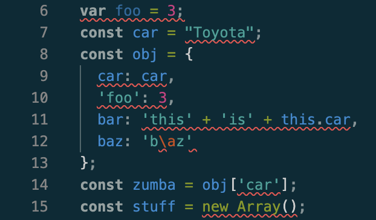

Since the beginning of my computer science journey, I have never been great at sticking to coding standards. I would begin my programs with the correct indentation and spacing, but as I got into coding, I would forget about creating a separate line from functions or adding spaces before brackets. Thus, my programs ended up semi-formatted, and sometimes it was difficult to differentiate my lines of code. As a result, I had to go back and clean up my messy code, which was often frustrating and time-consuming. 

## Red All Over
Now that I have spent a week using ESLint in VSCode, I am beginning to get the hang of coding standards. At first, ESLint was overwhelming with all of the red lines spread across my screen, flagging things that I thought were insignificant. Error messages like “missing space before opening brace” or “trailing spaces not allowed” seemed trivial to me. The program ran without issues, and I could not understand why ESLint was underlining them like they were major problems. This part of ESLint felt a little nitpicky and unnecessary to me.

## The CRC (Consistent, Readable, Collaboration)
Over time, I quickly realized that ESLint's error messages were not just for aesthetic purposes; they were teaching me consistency and organization. Instead of waiting to reformat my program at the end, I learned to format my code as I wrote it. This made my programs way easier to read, and less confusing, since I could clearly recognize what each block of code did. In addition, keeping a consistent program structure helped me to be more productive and focused on solving the problem as the readability and flow reduced potential bugs. 

Futhermore, I came to understand that following a coding standard is important for others who may read or analyze my code in the future. In the past, I wrote programs solely for myself and often overlooked standards because I already understood how my code worked. However, now that I am in software engineering and collaborating with others, I realized that my code also needs to be clear enough to communicate my intentions and goals, not just run correctly. ESLint reinforces this by emphasizing consistency and readability, which are habits that improve the overall quality of a program, and also make collaboration more clear and efficient.

## Understanding Syntax
I have also noticed that ESLint has deepened my understanding of how different data types and functions work. For example, it would remind me to use `const` instead of `let` for variables that are never reassigned, helping me write safer code to prevent bugs. Moreover, ESLint strengthened my skills in Typescipt by consistently prompting me to specify data types for parameters of functions or add commas after values in an object literal. From these reminders, I became more comfortable with Typescript and functional programming methods, which greatly improved my skills as a rising software engineer.

## ESLint is stressful but useful
Overall, my first week using ESLint was both challenging and rewarding. Though I initially struggled to break old habits of inconsistent formatting, I began to adapt to the coding standards of ESLint. I feel that ESLint has already made me a better programmer through which I am able to quickly identify and understand the components of my code. While I still cringe whenever I see those red squiggly lines, I remind myself to view them not as inconveniences, but as strengthening my coding discipline. I am hopeful that these habits will become second nature in the future, allowing me to easily write clean and consistent code.
