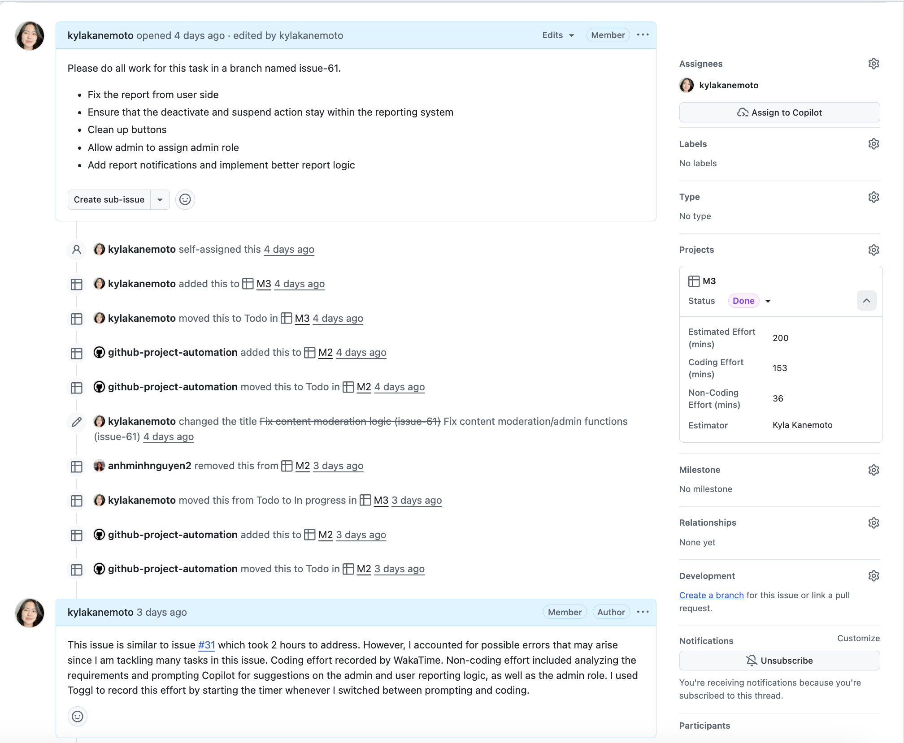

Effort estimation in software development often feels like stepping into a rabbit hole—what seems straightforward at first quickly becomes more complex as you move forward.

## Forming Initial Estimates

I made my effort estimates primarily by drawing on my prior experience with Workout of the Day (WOD) assignments earlier in the course. Through those assignments, I developed a general sense of how long certain types of tasks tend to take, such as setting up backend logic, implementing frontend components, and debugging errors. I relied on this experience and used pattern recognition from past work to estimate how much time similar tasks in the project might require.

## Making Sense of the Chaos

Although my estimates were not always accurate, estimating in advance was still very beneficial. It helped me think intentionally about how to portion my time across different tasks instead of working aimlessly. For example, when configuring the admin management tables, I broke the issue down and assigned rough time limits to each part so I would not spend too much time on a single section. Estimation also helped me recognize patterns between backend and frontend work. In many cases, building backend functionality took longer upfront, while frontend tasks—although sometimes tedious—often required more time than expected due to styling details and minor fixes. Even when the estimates were not exact, they helped me stay aware of how my time was being used and when I needed to move on.

## Reality Check

Tracking my actual effort proved to be highly useful and directly informed my future estimates and project decisions. By comparing my estimated time to the actual time spent, I was able to make quicker and more realistic estimates for new issues. My experience with WODs, combined with actual effort tracking, allowed me to assess assigned issues more efficiently and determine reasonable time commitments. This also helped me balance my workload across classes, since I had a clearer understanding of how much time I needed to dedicate to software engineering on a given day.

As this process continued, effort estimation and tracking became part of my regular workflow. For each issue I worked on, I would leave a comment noting my estimated effort and often based that estimate on a similar issue I had completed previously. After finishing the task, I would then record my actual coding and non-coding effort using my tracking tools. Over time, this routine became second nature, and consistently comparing past issues to new ones helped me estimate more confidently and work more intentionally.

In addition to my individual tracking, my final project group and I recorded our estimated and actual effort in a shared table to maintain transparency and consistency across the team. This allowed us to compare estimations versus reality at both the individual and group level. The table documenting our estimates and actual effort can be found [here](https://github.com/manoaroomiematch/manoaroomiematch.github.io/blob/8d8aafec3d2d31411fe037b0e788abc85326d3ad/Project%20Effort%20Report.xlsx).

I noticed a consistent pattern where I would slightly exceed my estimates due to unexpected bugs or errors. However, as I continued tracking my actual effort, my estimates gradually became more accurate and I developed a structured approach to tasks. For example, I would allocate around 15 minutes to build basic frontend components without functionality, then commit an additional 20–30 minutes to implementing surface-level functions. If no major issues arose, I could move forward efficiently. When errors did occur, I adjusted my expectations and compensated for them in future estimates.

  

## Following the Trail

To track my actual effort, I primarily relied on WakaTime for coding-related work. Since it integrates directly with VS Code, it automatically tracked my time whenever I was actively coding, which allowed me to focus fully on the task without worrying about starting or stopping timers. Initially, it took some time to understand the WakaTime dashboard and interpret its graphs, but it became extremely useful during the final project, especially when I needed to use time wisely to meet deadlines.

For non-coding effort, such as researching solutions, planning features, or consulting tools like Copilot or ChatGPT for guidance, I used Toggl. This required manually starting and stopping the timer, similar to a stopwatch, but it logged my time efficiently and displayed weekly summaries that helped me identify trends. I found that larger issues often required more non-coding effort due to increased complexity and debugging. For instance, building the Admin API required significant research to understand its internal structure and how it connected to other parts of the system. In contrast, creating initial UI mockups required much less non-coding time since the planning process was more straightforward.

Overall, I believe my effort tracking was fairly accurate. Although it may not have captured every minute perfectly, it provided a reliable overview of how my time was distributed across tasks and issues. This visualization helped me reflect on my workflow and make informed adjustments moving forward.

## Lessons from the Journey

I did not use AI for effort estimation or tracking during this project, since I relied on my previous experience from the WODs. However, estimating effort was sometimes difficult, especially for tasks where I anticipated running into many issues. In the future, I would like to experiment with using AI to assist with estimation and tracking to see whether it could improve speed or accuracy. I am also interested in seeing whether AI could help break tasks into smaller components and better account for potential errors. While I am not certain how effective this would be, the increasing role of AI in software development makes it worth exploring. Incorporating AI into my workflow may help me become a more time-efficient and intentional software engineer.
