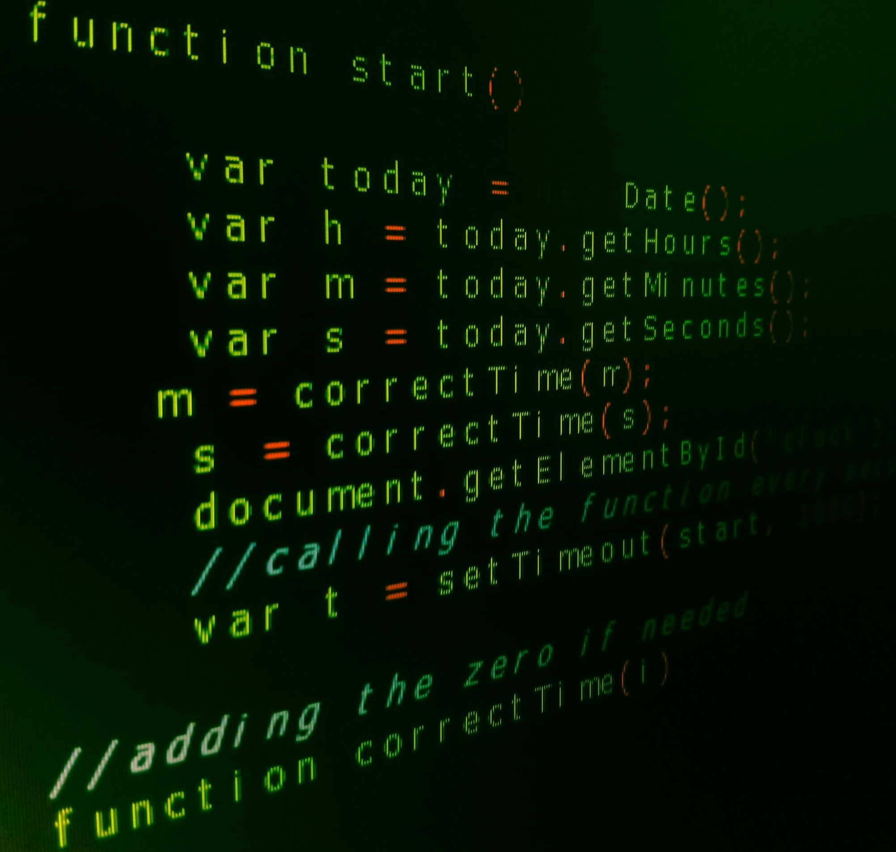

## Learning a New Language

My first encounter with JavaScript and TypeScript was challenging, since the only language I knew at the time was Java. However, after working through 160 modules, I began making connections between Java and these new languages, which helped me become familiar with their structures and syntax. One feature in JavaScript that stood out was its use of first-class functions—functions that can be assigned to variables, passed as arguments, or returned from other functions. This flexibility contrasts with Java, where functions must be created as methods within classes and require explicit type declarations to execute properly. In this sense, JavaScript felt cleaner and more beginner-friendly than Java, making it easier for someone like me to experiment with new programming concepts and develop confidence in writing functional code.

## Better than the Javas?

From a software engineering perspective, I found TypeScript to be more logical than both Java and JavaScript. Its static typing defines and verifies variables and functions at compile time, reducing the likelihood of bugs and making the code more reliable. Minimizing runtime errors is crucial in software engineering because it allows programs to run efficiently and engineers to work productively. A feature that particularly impressed me was the union type, which allows variables and parameters to accept multiple types. This flexibility makes code more maintainable, in contrast to Java’s strict type system. Overall, TypeScript enhances both the structure and security of code while maintaining the flexibility of JavaScript. Therefore, making it a practical and effective programming language that balances reliability with creative freedom for developers.

## Practice Makes Perfect: The Athletic Approach

The Athletic Software Engineering method in ICS 314 emphasizes a time-constrained, intensive approach to skill-building. A key part of this method is the Workout of the Day (WOD), coding problems that must be solved within a set time. My first attempts at WODs were frustrating because I had no strategy, and I often failed to complete them within the allotted time. However, consistent practice allowed me to develop stronger problem-solving skills, build efficient strategies, and improve my completion times significantly. While I am not yet fully proficient, I am confident that with continued effort and reflection, I will fine-tune my abilities to work effectively under pressure and gain a higher level of programming confidence.

## Looking Ahead: Will It Work Out?

I believe that this athletic style of learning will help me become an efficient and adaptable software engineer. Although the stress of WODs is inevitable, it encourages critical thinking, strategic decision-making, and the ability to perform under pressure—all essential skills in the software industry. Beyond coding, this approach fosters perseverance and resilience, teaching me to view mistakes as learning opportunities rather than failures. By maintaining a growth mindset, staying consistent in my practice, and embracing challenges, I am confident that I will not only strengthen my technical skills but also develop the professional habits necessary to succeed in any collaborative or high-pressure environment. This method prepares me for real-world software development, where deadlines, debugging, and complex problem-solving are everyday realities, and ensures that I am ready to meet these challenges with skill, creativity, and confidence.
