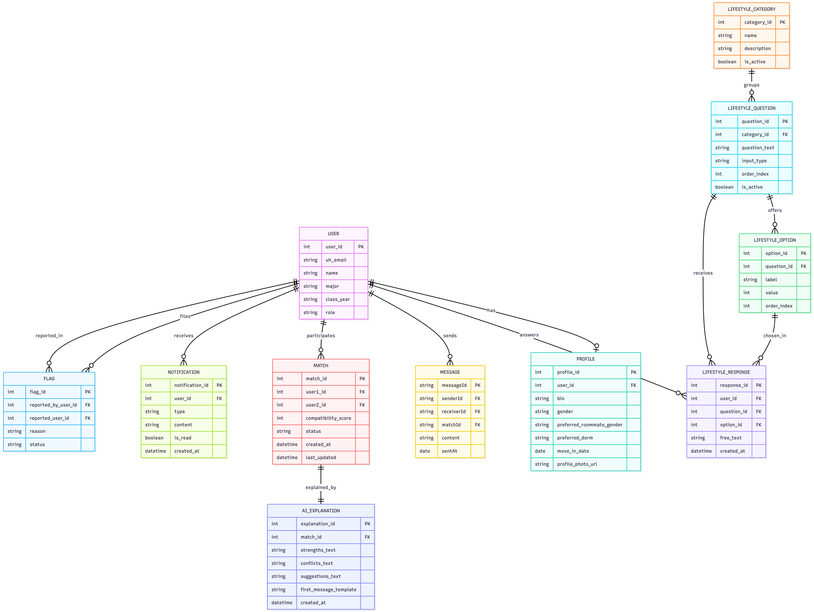

I’ve played piano for over a decade, and something I’ve learned throughout the years is that music only feels effortless when there’s solid technique supporting it. Exceptional playing comes from years of scales, fingering patterns, and chord progressions. These patterns aren't a restriction, but rather, give one confidence to play with both control and expression. Working with my team on our final project, ManoaRoomieMatch, made me realize that software engineering isn’t that different from playing an instrument. Design patterns are basically the “technique” of coding where the methods make everything cleaner and easier to work with.

## Technique Behind the Notes
Our project uses React and React Bootstrap on the client side, Next.js for server logic, and PostgreSQL for the database. I see these layers like different parts of an ensemble—each one has a role, and if they weren’t coordinated, everything would clash. A design pattern that our application heavily relies on is the Client–Server pattern, where the browser asks for something and the backend responds. It’s simple, but it gives the whole system a steady rhythm. It reminds me of how a pianist’s left hand anchors the right-hand melody. Each side has its job, and things work due to that balance.

Another pattern I’ve found surprisingly helpful is the Module Pattern, especially through JavaScript’s static imports. Breaking the project into components and helpers keeps the code from turning into a giant, unreadable file. It’s like practicing scales or arpeggios on their own—you break the music into manageable pieces so you actually understand what’s happening. Using modules makes the project feel less overwhelming, reduces bugs, and makes it easier for the whole team to contribute without stepping on each other’s work. In our application, each API route lives in its own file and handles everything for that endpoint. For example, the `/api/admin/users` route exports two functions: GET and POST.
```
// api/admin/users/route.ts
import { NextResponse } from 'next/server';
import { getServerSession } from 'next-auth';
import { prisma } from '@/lib/prisma';
import authOptions from '@/lib/authOptions';

export async function GET() {
// Fetches users and their profiles
}

export async function POST(req: Request) {
// Deletes a user by ID
}
```
This keeps the logic for each HTTP method in one place and keeps the routing straightforward. Everything needed in this route is also imported at the top, so the file stays organized and readable.

Prisma utilizes another pattern, the Adapter pattern, which takes our TypeScript models and translates them into SQL queries behind the scenes. If I had to write raw SQL everywhere, it would feel like sight-reading a piece written in a musical style I’d never studied before. Prisma handles that translation so the backend side feels more intuitive and consistent. It also helps two very different systems communicate without clashing with one another.

## Notes in Order
A design choice that worked really well in our project was how we structured the lifestyle survey data. Instead of stuffing all the answers directly inside the User table—which would be like cramming an entire song onto one line of sheet music—we created a join table where each response gets its own row. This relational association pattern keeps the data organized, easy to query, and flexible for future features. It’s a pattern you’ll see in most well-designed relational databases, and using it here makes the entire application cleaner and more scalable.

<p align="center">
  
</p>

## Playing with Confidence
Even though the project isn’t finished yet, these patterns have shaped how we build new features and track down bugs. Just like in piano, good technique makes everything feel intentional. Good design patterns do the same thing—they help the project grow without falling apart. If someone asks, “What are design patterns?” or “Which ones are you using?”, I’ll think back to technique. In music, technique turns scattered notes into something expressive. In software engineering, design patterns turn scattered components into a system that’s logical and functional. In ManoaRoomieMatch, we have used the Client–Server pattern, the Module Pattern, the Adapter pattern through Prisma, and relational association patterns in our database. These patterns have made the project far more manageable, and they’ve given me confidence in the structure and integrity of our application. They really are essential parts of building good software.
