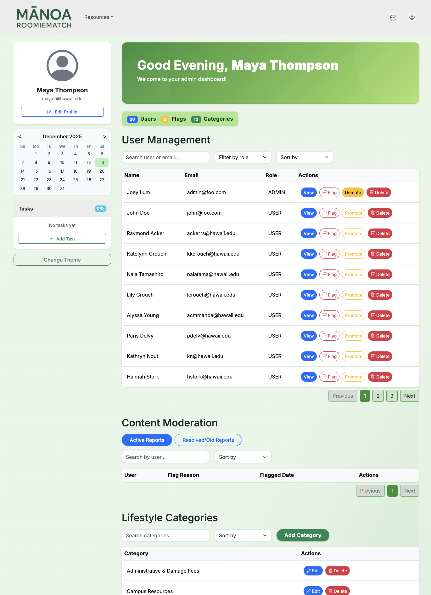
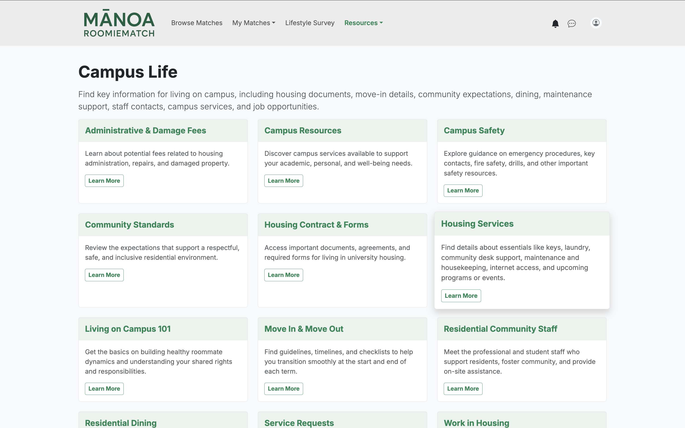
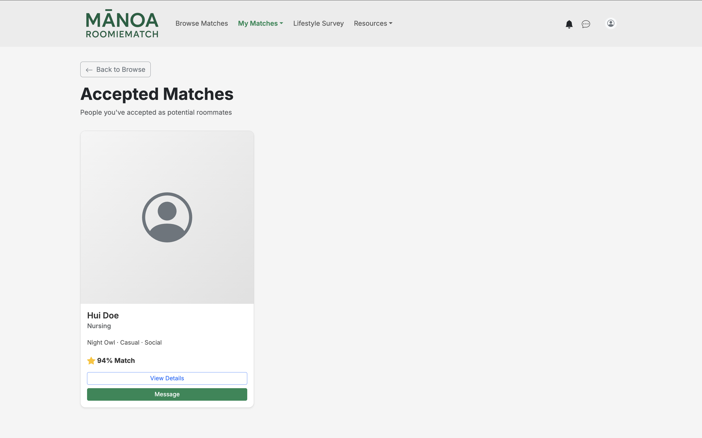

## Overview

Mānoa RoomieMatch is a web application designed to help University of Hawaiʻi at Mānoa students find compatible roommates. Students log in using their UH account and complete a lifestyle questionnaire. The questions cover preferences such as sleep schedule, cleanliness, study habits, noise tolerance, guests, and budget or space needs. After completing the questionnaire, users create a public profile that includes a headshot, major, graduation date, and other personal information they wish to share. Based on their survey responses and profile, the system generates a compatibility score. It also provides an explanation of where users are similar and where potential conflicts might occur. Students can browse potential matches, view detailed comparisons, save or reject matches, and message other users directly. The platform also includes helpful resource pages and AI-assisted features, such as suggested messages. Admin users can manage the platform by flagging profiles and inappropriate content, overseeing lifestyle categories, and handling role promotions.

## My Contributions

For the ICS 314 final project, I worked on several key parts of the application. My main responsibility was developing the “Admin Home Page”, where I handled both frontend and backend functionality and provided administrators with tools to manage the platform and maintain content quality. I also implemented the “Campus Life” page, which gives students useful information about living on or near campus. On the “Browse Matches” page, I developed the “Saved Matches”, “Accepted Matches”, and “Passed Matches” pages, allowing users to track and manage their interactions with potential roommates. I also worked on the “Messaging” page, making the buttons and dropdowns functional. Additionally, I ensured the application was mobile-friendly by adjusting CSS styling and layout for smaller screens. I implemented a notification system for users who submit reports, providing confirmation that their report was reviewed.

  
  
  

## Key Takeaways

Working on Mānoa RoomieMatch showed me how complex software engineering projects can be, especially in a large group. Small problems often turned into multiple tasks, which made time management and planning crucial. Through this project, I learned how to collaborate effectively, communicate progress and issues clearly, and use AI tools in a software engineering context. I also gained experience considering ethical aspects of software design, prioritizing transparency and user-friendliness. Ultimately, I developed stronger skills in project planning, risk management, and design models, which deepened both my technical abilities and understanding of real-world web application development.

*For more information about Mānoa RoomieMatch, visit our [Organization GitHub Page](https://github.com/manoaroomiematch).*
