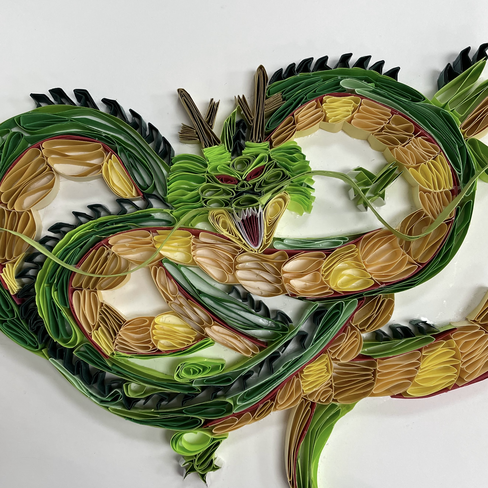

  

For an art assignment, I created a paper quilling of Shenron from Dragon Ball Z. The goal was to fill an 8”x 10” sheet of paper with strips of colored paper, using techniques such as coiling, rolling, and shaping to form the design.  With a fast-approaching deadline, I knew I needed to carefully plan and stay consistent with my work. My vision was ambitious as I wanted to include a detailed sky background in addition to Shenron himself, so the piece felt more complete and balanced. 

At first, I felt confident with the workload, but quickly realized how much patience and precision paper quilling required. Cutting, rolling, shaping, and gluing each strip of paper was more time-consuming than I expected. For example, it took nearly two days to finish just Shenron’s head. I had made the paper coils tight-knit for a cleaner look, but sometimes the paper would crease the wrong way or fall over if the glue hadn’t set fully. As time ran out, I decided to scale back on the idea and focus solely on Shenron rather than the background. There were moments when I considered switching to an easier subject, feeling disappointed for not being able to fulfill my entire vision. However, I chose to stay committed to my original idea and completed it to the best of my ability. This decision paid off when my finished piece not only exceeded both my expectations and my instructor’s, even being selected for a student art competition.

Paper quilling was a strenuous but rewarding experience that honed my patience and focus. I learned that art often requires perseverance and creative problem-solving, especially when working with intricate mediums. Ultimately, this project taught me the importance of staying committed no matter the challenge because doing so can lead to accomplishments more meaningful than taking the easy route.
