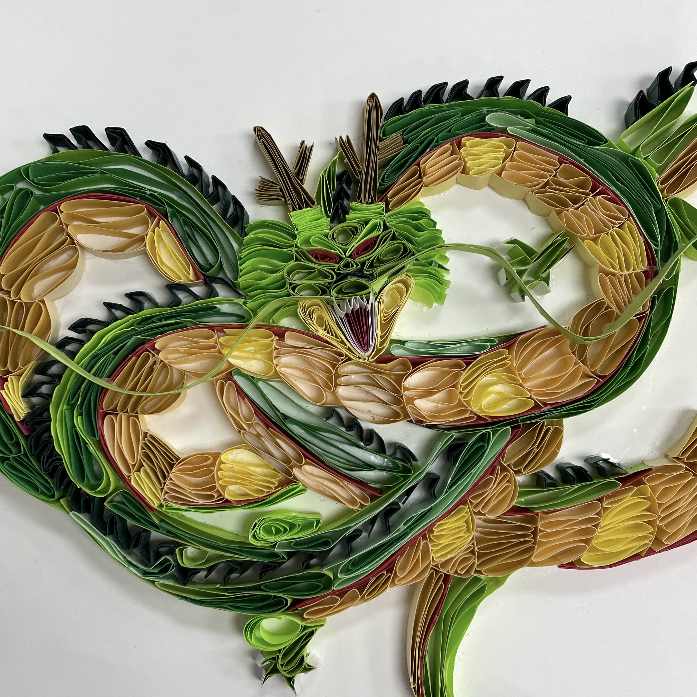

  

For an art assignment, I created a paper quilling artwork inspired by Shenron from Dragon Ball Z. The objective was to completely fill an 8” × 10” sheet of paper using strips of colored paper and techniques such as coiling, rolling, and shaping. With a tight deadline approaching, I knew the project would require careful planning and consistency. My initial vision was ambitious, as I wanted to include a detailed sky background in addition to the main figure so the composition would feel balanced and complete.

At the start, I felt confident about managing the workload, but I quickly learned how much patience and precision paper quilling requires. Each strip had to be cut, rolled, shaped, and glued, which made the process far more time-consuming than I expected. For example, it took nearly two days just to complete the head of the figure. I packed the coils tightly to achieve a clean, polished look, but the paper would sometimes crease incorrectly or collapse before the glue fully set. As the deadline approached, I chose to simplify the design and focus entirely on the main subject rather than adding the background. Although I felt disappointed about not fully realizing my original vision and briefly considered switching to an easier idea, I ultimately stayed committed to the piece and completed it to the best of my ability.

In the end, that decision paid off. The finished artwork exceeded both my expectations and my instructor’s, and it was even selected for a student art competition. While paper quilling was a demanding medium, it was also highly rewarding and strengthened my patience and attention to detail. This project taught me that perseverance and creative problem-solving are essential in art, and that staying committed through challenges often leads to more meaningful results than taking the easier route.
