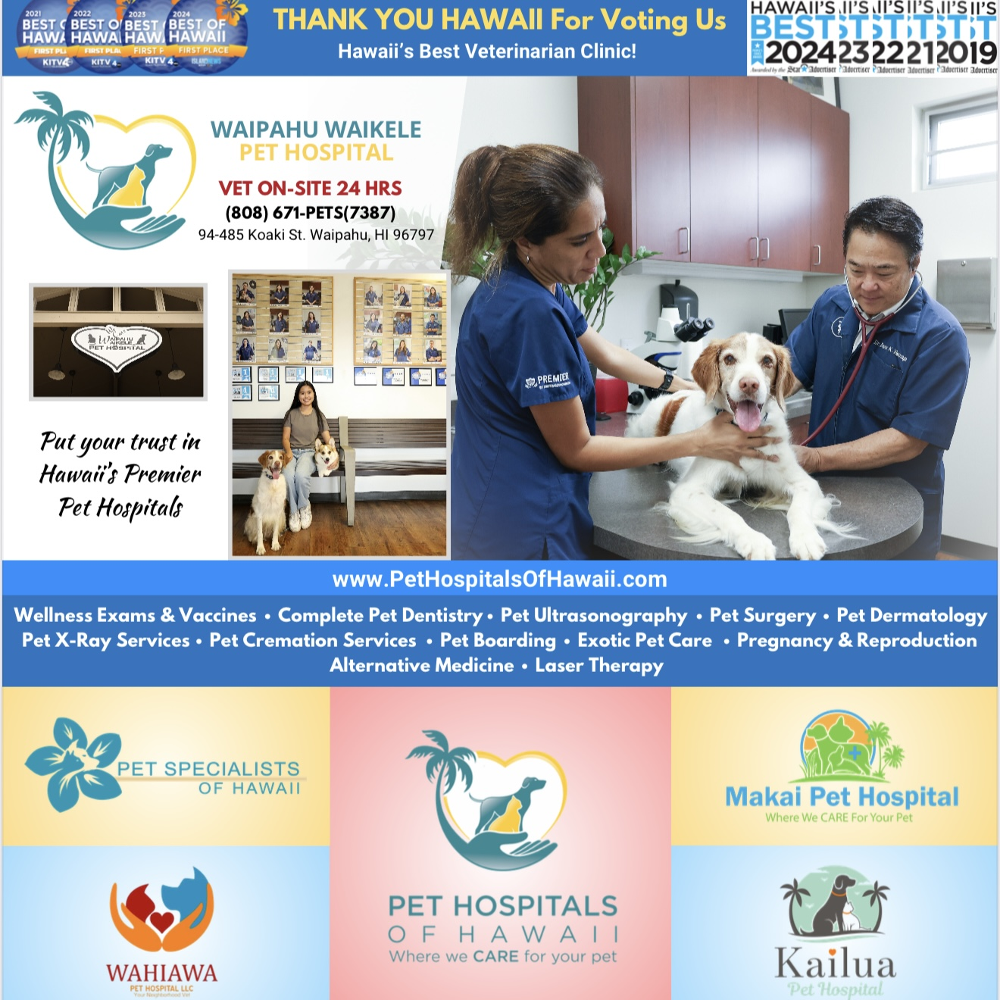

  

I designed an advertisement for Waipahu Waikele Pet Hospital to celebrate its sixth consecutive year as Hawaii’s Best Veterinarian Clinic. Despite my lack of experience in graphic design, I taught myself the necessary skills through online tutorials and experimentation with various tools and applications. My goal was to create a design that not only celebrated the hospital’s achievement but also captured its warm, community-driven atmosphere.

I was responsible for the photography, editing, and overall composition of the advertisement. To guide my work, I looked into Waipahu Waikele Pet Hospital’s previous advertisements and social media pages. I then took candid shots of the reception area and interactions between the clients, veterinarians, and pets to convey an authentic and lively atmosphere. Using Adobe Lightroom, I adjusted the lighting and clarity of the photos before transferring them to Canva, where I assembled the final layout. I experimented with the different fonts, colors, and proportions until I created a vivid and welcoming design. During the final stages, I incorporated the feedback from Waipahu Waikele Pet Hospital, making minor changes to ensure the advertisement met their expectations.

From this experience, I learned the importance of adaptability and resourcefulness when working outside of my comfort zone, as challenges inevitably appear in unfamiliar tasks. In addition, I refined my photography, editing, and designing abilities, while also developing stronger communication skills through applying constructive criticism. Collaborating with Waipahu Waikele Pet Hospital showed me how valuable an open mind and creativity are in constructing something that resonates with a diverse audience. Overall, this project instilled in me a greater appreciation for those in the creative community and demonstrated how curiosity and a willingness to learn can enhance the quality and impact of my work.
